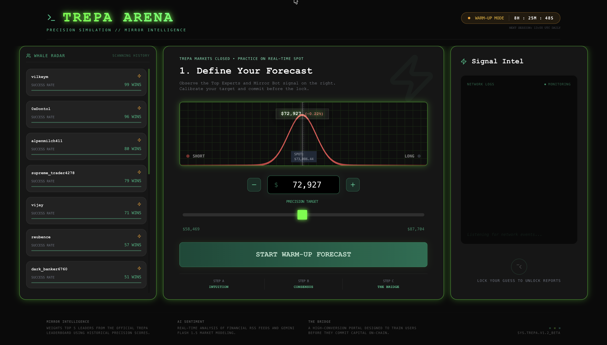

# 🎮 Trepa Arena: Precision Mirror Bot

A high-performance prediction dashboard and automated mirror bot built on the **Trepa SDK**. This project simulates professional trading "Intelligence" by mirroring the top-performing experts on the Trepa network.



## 🚀 Key Features

- **Mirror Intelligence:** Automatically calculates the consensus forecast of the top 20 experts in any active pool.
- **Whale Radar:** A deep-scan analytics engine that tracks "Market Whales" (High Stake + High Precision) across 100+ historical rounds.
- **AI Sentiment:** Real-time news analysis using Hugging Face (Mistral-7B) to provide a secondary "AI Signal."
- **Auto-Mirror Bot:** A GitHub Action-powered bot that executes predictions during live rounds based on expert consensus.

## 🤖 Dual-Automation System (Crons)

This project uses a sophisticated two-tier automation system to keep the Arena live 24/7 without manual intervention.

### 1. The Mirror Bot (GitHub Actions)
- **Schedule:** Every minute during the 13:00 UTC live hour (`* 13 * * *`).
- **Role:** The **"Muscle."** It joins the active Bitcoin Flash pools, calculates the Mirror Signal, and submits predictions on-chain.
- **Persistence:** It sends real-time logs to the Vercel API so you can monitor its performance on the dashboard.

### 2. The Whale Radar Sync (GitHub + Vercel)
- **Schedule:** Once daily at 13:00 UTC (`0 13 * * *`).
- **Role:** The **"Brain."** It performs a 100-pool deep scan to find the most successful experts (99+ wins) and calculates their Authority Scores.
- **Database Strategy:** To bypass Vercel's ephemeral file system, this cron **commits and pushes** the updated `whales_cache.json` back to GitHub. The dashboard then fetches this "Live Database" file directly from the GitHub Raw CDN.

## 🐳 Whale Scoring Algorithm

The **Whale Radar** doesn't just look at who is winning today; it performs a **100-pool Deep Scan** to calculate a weighted "Authority Score" for every player on the network.

### The Formula:
$$Score = (Wins \times 50) + (SOL\ Staked \times 10) + (Win\ Rate \times 2) + Avg\ Precision$$

### Scoring Metrics:
- **Historical Wins (Weight: 50):** We use **Relative Win Logic**. A win is awarded if a player finishes in the **Top 10%** of a round's precision.
- **Total Conviction (Weight: 10):** Total SOL staked across the scanned history. High conviction signifies a "Market Whale."
- **Win Rate (Weight: 2):** Percentage of rounds entered that resulted in a "Top 10%" finish.
- **Avg Precision (Weight: 1):** The raw average precision score (0-100) across all historical entries.

### Market Tiers:
- **Market Whale:** Players with **>10 SOL** total stake or **>5 historical wins**.
- **Expert:** High-precision players who haven't yet reached Whale-level volume.

## 🛠️ Trepa APIs Used

This project leverages the following [Trepa Developer APIs](https://docs.trepa.io/developers/introduction):

1.  **[Streaks API](https://docs.trepa.io/developers/api-reference/streaks):** Used to identify active Bitcoin Flash rounds and fetch historical pool lists for the Whale Radar.
2.  **[Pools API](https://docs.trepa.io/developers/api-reference/pools):** Used to fetch real-time prediction data and specific pool metadata.
3.  **[Predictions API](https://docs.trepa.io/developers/api-reference/predictions):** Powering the mirror logic by retrieving specific forecasts from the network.
4.  **[Users API](https://docs.trepa.io/developers/api-reference/users):** Used to fetch deep lifetime statistics (wins, precision, stake) for identified whales.

## 💻 Local Setup

### 1. Prerequisites
- Node.js 20+
- A Trepa API Key & Private Key (Get them from [Trepa.io](https://trepa.io))

### 2. Installation
```bash
git clone https://github.com/SAHU-01/my_trepa_bot.git
cd my_trepa_bot
npm install
```

### 3. Environment Variables
Create a `.env` file:
```env
TREPA_API_KEY=your_api_key
TREPA_PRIVATE_KEY=your_private_key
HUGGINGFACE_API_KEY=your_optional_hf_key
```

### 4. Running Locally
For a full simulation, open **two separate terminal windows**:

**Terminal 1: The Dashboard**
```bash
npm run dev
```

**Terminal 2: The Mirror Bot**
```bash
# This will listen for new rounds and mirror experts
npx tsx bot.ts
```

**Optional: Manual Whale Refresh**
```bash
# Performs a 100-pool deep scan to populate your local database
npx tsx force_cache.ts
```

## ☁️ Deployment

### Vercel (The Dashboard)
1.  Connect your repo to Vercel.
2.  Add `TREPA_API_KEY` and `TREPA_PRIVATE_KEY` to Environment Variables.
3.  **Note:** On the Hobby plan, the Whale Radar will refresh via "On-Visit" logic because Vercel limited Crons to once per day.

### GitHub Actions (The Bot & Database)
We use GitHub as a "Database" for whale data:
1.  Go to **Settings > Secrets and variables > Actions** and add your Trepa keys.
2.  Go to **Settings > Actions > General** and set **Workflow permissions** to **"Read and write"**.
3.  The `Whale Radar Sync` action will run, update `whales_cache.json`, and push it back to the repo, which the dashboard then fetches.

## ⚠️ Known Limitations
- **API 500s:** During extremely high-traffic rounds, the Trepa API may return a `TrepaError`. The bot is programmed to fall back to the BTC spot price gracefully.
- **Hobby Cron Limit:** Vercel Hobby accounts only support 1 cron job per day. The dashboard handles this by fetching from the GitHub "Database" file.

## 🤝 Contributing
Contributions are welcome! 
- **Bug Reports:** Please [raise an issue](https://github.com/SAHU-01/my_trepa_bot/issues) if you encounter any `TrepaError` or UI glitches.
- **Pull Requests:** PRs for improving the scoring algorithm or adding new streaks (SOL, ETH) are encouraged.

## 📜 License
MIT License. Feel free to fork and build your own Arena!
